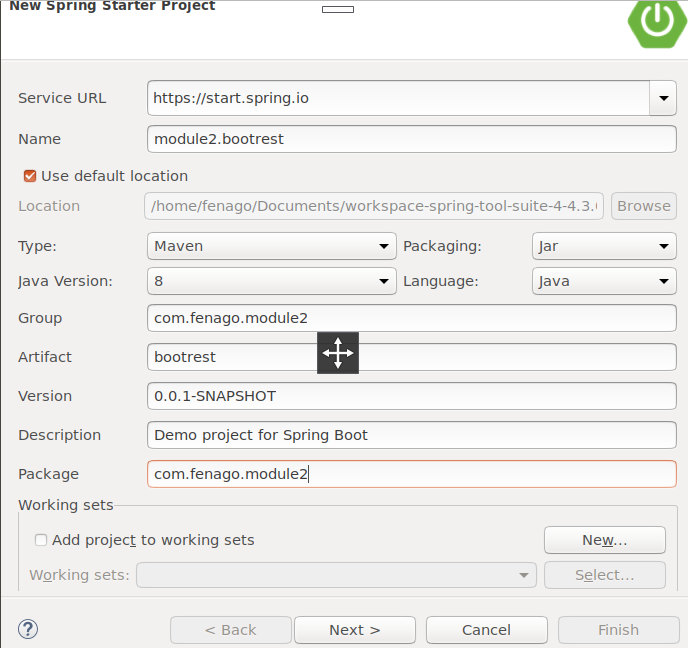
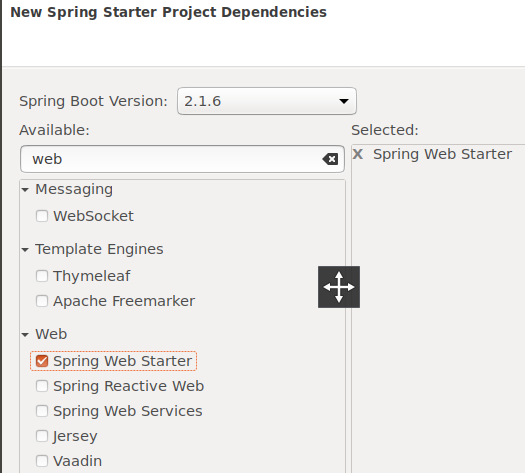
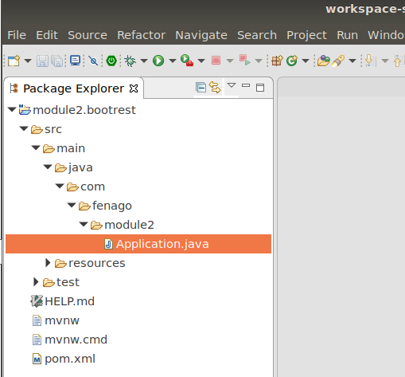

<!----- Conversion time: 1.207 seconds.

Using this Markdown file:

1. Cut and paste this output into your source file.
2. See the notes and action items below regarding this conversion run.
3. Check the rendered output (headings, lists, code blocks, tables) for proper
   formatting and use a linkchecker before you publish this page.

Conversion notes:

* Docs to Markdown version 1.0β17
* Thu Jul 04 2019 14:29:21 GMT-0700 (PDT)
* Source doc: https://docs.google.com/open?id=1IWtasxgwfnmoyN_5MvbzWQRLz9L5lNXpZ9_5nkZcrnM
* This document has images: check for >>>>>  gd2md-html alert:  inline image link in generated source and store images to your server.
----->

Lab 3 - Create a Spring Boot Java Microservice with STS

1. Step 1:  Launch STS4
2. Open STS, right-click within the **Project Explorer** window, navigate to **New** | **Project**, and 
3. Step 2: Launch Spring Starter Project
4. select **Spring Starter Project**, and click on **Next**:
Spring Starter Project is a basic template wizard that provides a number of other starter libraries to select from.
5. Type the project name as `module2.bootrest` or any other name of your choice. It is important to choose the packaging as JAR. In traditional web applications, a war file is created and then deployed to a servlet container, where Spring Boot packages all the dependencies to a self-contained, autonomous JAR file with an embedded HTTP listener.
6. Select 1.8 under **Java Version**. Java 1.8 is recommended for Spring 4 applications. Change the other Maven properties such as **Group**, **Artifact**, and **Package**, as shown in the following screenshot:

7. Once completed, click on **Next**.
8. The wizard will show the library options. In this case, as the REST service is developed, select **Web** under **Web**. This is an interesting step that tells Spring Boot that a Spring MVC web application is being developed so that Spring Boot can include the necessary libraries, including Tomcat as the HTTP listener and other configurations, as required:

9. Click on **Finish**.
This will generate a project named `module2.bootrest` in **Project Explorer** in STS:

10. Take a moment to examine the generated application. Files that are of interest are:
    *   `pom.xml`
    *   `Application.java`
    *   `Application.properties`
    *   `ApplicationTests.java`

<!-- Docs to Markdown version 1.0β17 -->
