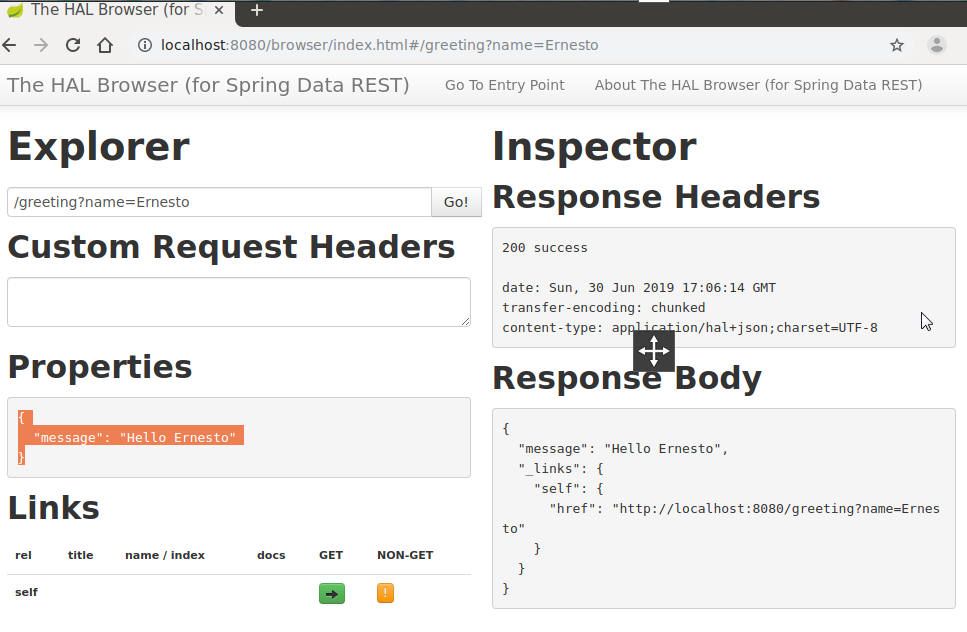

Lab 5 : HATEOAS


1. In order to use Spring Initilizr, go to [https://start.spring.io](https://start.spring.io/):


<p id="gdcalert2" ><span style="color: red; font-weight: bold">>>>>>  gd2md-html alert: inline image link here (to images/Lab-51.png). Store image on your image server and adjust path/filename if necessary. </span><br>(<a href="#">Back to top</a>)(<a href="#gdcalert3">Next alert</a>)<br><span style="color: red; font-weight: bold">>>>>> </span></p>


3. Fill the details, such as whether it is a Maven project, Spring Boot version, group, and artifact ID, as shown earlier, and click on **Switch to the full version** link under the **Generate Project** button. Select **Web**, **HATEOAS**, and **Rest Repositories HAL Browser**. Make sure that the Java version is 8 and the package type is selected as **JAR**:
4. 


5. Once selected, hit the **Generate Project** button. This will generate a Maven project and download the project as a ZIP file into the download directory of the browser.
6. Unzip the file and save it to a directory of your choice.
7. Open STS, go to the **File** menu and click on **Import**:
8. 


9. Navigate to **Maven** | **Existing Maven Projects** and click on **Next**.
10. Click on **Browse** next to **Root Directory** and select the unzipped folder. Click on **Finish**. This will load the generated Maven project into STS' **Project Explorer**.
11. Edit the Hateoas`Application.java` file to add a new REST endpoint, as follows:
12. 
13. ```
@RequestMapping("/greeting")
@ResponseBody
public HttpEntity<Greet> greeting(@RequestParam(value = "name", required = false, defaultValue = "HATEOAS") String name) {
       Greet greet = new Greet("Hello " + name);
       greet.add(linkTo(methodOn(GreetingController.class).greeting(name)).withSelfRel());
 
       return new ResponseEntity<Greet>(greet, HttpStatus.OK);
}```
14. Note that this is the same `GreetingController` class as in the previous example. However, a method was added this time named `greeting`. In this new method, an additional optional request parameter is defined and defaulted to `HATEOAS`. The following code adds a link to the resulting JSON code. In this case, it adds the link to the same API:
15. 
16. `greet.add(linkTo(methodOn(GreetingController.class).greeting(name)).withSelfRel());`
17. In order to do this, we need to extend the `Greet` class from `ResourceSupport`, as shown here. The rest of the code remains the same:
18. 
19. `class Greet extends ResourceSupport{`
20. The `add` method is a method in `ResourceSupport`. The `linkTo` and `methodOn` methods are static methods of `ControllerLinkBuilder`, a utility class for creating links on controller classes. The `methodOn` method will do a dummy method invocation, and `linkTo` will create a link to the controller class. In this case, we will use `withSelfRel` to point it to itself.
21. This will essentially produce a link, `/greeting?name=HATEOAS`, by default. A client can read the link and initiate another call.
22. Run this as a Spring Boot app. Once the server startup is complete, point the browser to `http://localhost:8080`.
23. This will open the HAL browser window. In the **Explorer** field, type `/greeting?name=World!` and click on the **Go** button. If everything is fine, the HAL browser will show the response details as shown in the following screenshot:
24. 





As shown in the screenshot, the **Response Body** section has the result with a link with `href` pointing back to the same service. This is because we pointed the reference to itself. Also, review the **Links** section. The little green box against **self** is the navigable link.


It does not make much sense in this simple example, but this could be handy in larger applications with many related entities. Using the links provided, the client can easily navigate back and forth between these entities with ease.


<!-- Docs to Markdown version 1.0β17 -->
